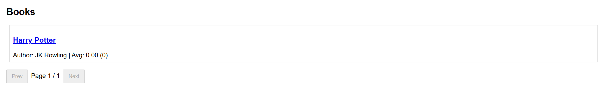

<b>📚 MERN Book Review Application</b>

This project demonstrates a full-stack Book Review Web App built with the MERN stack (MongoDB, Express, React, Node.js).

Below are the steps to set up and run the project, followed by screenshots including the MongoDB Atlas dashboard.

🛠️ Steps to Run the Project

Clone the repository

git clone https://github.com/Shreyareddy23/book-app.git
cd book-app

Backend Setup

cd backend
npm install

Create .env file:

PORT=5000
MONGO_URI=your_mongodb_connection_string
JWT_SECRET=your_secret_key

Start backend:

npm start

Frontend Setup

cd ../frontend
npm install

Ensure index.html exists in frontend/public/

Start frontend:

npm start

🖼️ Screenshots

Include images in a screenshots/ folder and reference them here:

🏠 Homepage

📖 Book Details

☁️ MongoDB Atlas Dashboard

